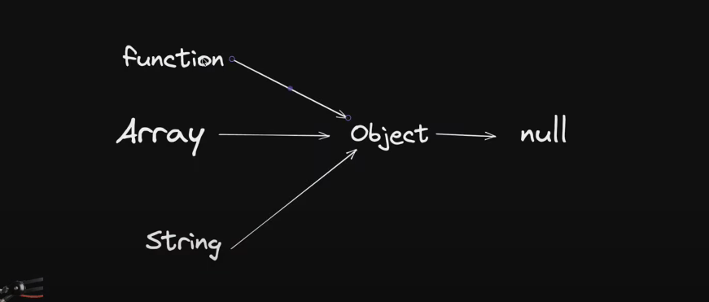

=> JavaScript is a scripting language 

=> JavaScript is an interpreted language (means that  scripts execute without preliminary compilation) 

=> javascript single threaded hoti hai 

=> default javascript synchronous hoti hai 

=> javascript execution context - defines the environment in which the code is executed 
                                  and includes things like the scope chain, variable object, 
                                  this value, and more.

## Three main types of execution contexts
        
             1. Global Execution Context:
                - The global execution context is the default context. 
                  It's the environment in which the code outside of any function is executed.

                - It includes the global object (in a web browser, it's window), 
                  a this value (in a web browser, it's also window), and 
                  a reference to the outer environment (which is null in the global context).
        


             2. Function Execution Context:
                - When a function is called, a new execution context is created for that function. 
                  This includes its own scope chain, variable object, and this value.

                - The scope chain is formed by the function's variable object and the variable
                  objects of its parent contexts (including the global context).

                - The this value depends on how the function is called (more on that later).
        
             3. Eval Function Context:

                - In JavaScript, eval() can be used to execute code in the current scope or 
                  in the global scope. When eval() is executed, a new execution context is 
                  created.
-------------------------------------------------------------------------------------------------------------------

## how js code is executed

1. memory creation phase 
2. execution phase

           let val1 = 10
           let val2 = 5
           function addnum(num1+num2){
               let total = num1+num2
               return total
           }
           
           let result1 = addnum(val1,val2)
           let result2 = addnum(10,2)

step1 => sbse pehle global execution hota hai aur isko this ke andar allocate krenge 

step2 => memory creation phase 

            val1 = undefined 
            val2 = undefined

            addnum = definition 

            result1 = undefined
            result2 = undefined

step3 => execution phase 

            val1 = 10
            val2 = 5

            addnum = definition 

            result1 = 
                       ===================== =================================================
            result2 =                      ||                                                 ||
                                           ||  new variable environment + execution thread    ||
                                           ||  // har baar nya bnta hai jitni bhi baar        || =========== >  kaam hone ke baad delete bhi ho jata hai 
                                           ||     functions execute hote hai                  ||
                                           ||                                                 ||
                                             =================================================
                                                                  ||
                                                                  ||
                                                                  ||
                                             =================================================  
                                             ||                                              ||
                                             ||                                              ||
                                        MEMORY PHASE                                    Execution Phase 

                                        val1 = undefined                                  val1 = 10
                                        val2 = undefined                                  val2 = 5
                                        total = undefined                                 total = 15
                                                            

----------------------------------------------------------------------------------------------------------


## CALL STACK 

-- The call stack is a data structure that keeps track of the current execution context. 
  It follows a Last-In, First-Out (LIFO) order, which means the most recently added context is the 
  first to be removed.

-- When a function is called, its context is pushed onto the stack. When a function finishes executing, 
  its context is popped off the stack, and control returns to the context below it.


-----------------------------------------------------------------------------------------------------------

## Truthy - Falsy values

Truthy vs falsy 

0 "" NaN undefined null - false  

Else every thing will be converted to true 


### NULLISH COALESCING OPERATOR( ?? )

===========================================


## HIGHER ORDER functions 

higher-order function is a function that can take one or more functions as 
arguments and/or return a function as its result. 
This means that functions are treated as values, just like strings or numbers. 


==============================================================================================
##  IIFE

IIFE Stands For Immediately Invoked Function Expression. It Is
A Way To Create A Function And Immediately Execute It Without Needing To Call It Later. Here's An Example:

``` javascript 

( function(){
// wrap function with () and then call it () 
})();
```
==============================================================================================

## MAPS 

// maps iteratable nhi hote

Maps => The Map object holds key-value pairs and remembers the original insertion order of the keys. 
        Any value (both objects and primitive values) may be used as either a key or a value.

suppose you have to perform a particular task on every member of the array , multiply every element of arrray with 2 
and then place the answers in the new array and eventually return that new array and that's exactly waht map does

``` javascript


const myNums = [1,2,3,4,5,6,7,8,9]

const resultarr = myNums.map( (num) => num + 10 ) 

```


==============================================================================================

## FILTER 

filter => creates a shallow copy of a portion of a given array, filtered down to just the elements 
          from the given array that pass the test implemented by the provided function.


Suppose you have an array and you want to filter out elements in a new array we will use filter 
let's sat array contains many numbers we want to extract only those numbers which are greater than 5
we will use filter 

``` javascript

const myNums = [1,2,3,4,5,6,7,8,9]

let newNums  = myNums.filter( (num)=> num >4 )
let newNums2 = myNums.filter( (num)=> {
      return num >4
})// agar hum scope laga rhe hai to return lgana pdega 
```

==============================================================================================

## REDUCE 

reduce => executes a user-supplied "reducer" callback function on each element of 
         the array, in order, passing in the return value from the calculation on 
         the preceding element. The final result of running the reducer across all 
         elements of the array is a single value.


EK array ki saari value par kuch perform karke ek value banane ke liye we use reduce

example => add all value of array, when we add all values , it gives us the sum which is a single value 
           any such case where we need to convert array into a single value that's where reduce is used 

``` javascript 
const myNums = [1,2,3]

const myTotal = myNums.reduce( function(acc, currval){
    console.log(`Acc: ${acc} and Currval: ${currval}`)
    return acc + currval

},0)

const myTotal2 = myNums.reduce( (acc,curr) => acc + curr , 0)
```
==============================================================================================

## DOM 


                              


                  =================================================
                ||                                                 ||
                ||                  WINDOW                         ||
                ||                                                 || 
                  =================================================
                                      ||
                                      ||
                  =================================================
                ||                                                 ||
                ||                  DOCUMENT                       ||
                ||                                                 || 
                  =================================================
                    ||                                            ||
         =========================                      =========================
       ||          HEAD           ||                  ||         BODY            ||
         =========================                      =========================
            ||              ||                              ||              ||
          meta            title                             h1               p


HTMLCollection me loop nhi laga skte usko pehle array me convert krna pdega lekin nodelist me 
hum direct loop laga skte hai 

==============================================================================================

## Events 

* Event propagation in JavaScript refers to the way events move through the different 
  elements in a web page's DOM (Document Object Model).

## There are two main phases of event propagation:

  1.Capturing Phase:

  > In this phase, the event starts from the outermost element (usually the window object) 
    and moves towards the target element.
  > It's like a "pre-processing" phase where elements higher up in the DOM tree get a chance 
    to intercept the event before it reaches the target element.
    Bubbling Phase:

  2.Bubbling Phase:

  > Once the event reaches the target element, it then "bubbles up" through the ancestors of the target element.
  > This is like a "post-processing" phase where elements higher up in the DOM tree get a chance to react to the event
    after it has been handled by the target element.


==============================================================================================

## ASYNC JS  

 > sync matlab ek ke baad dusra hoga , jab tak ek command complete na ho dusra shuru nahi hoga 

 > async matlab saare kaam ek sath shuru kardo jiska answer pehle aajye uska jawab dedena 
 
- > ye sare async code hai

  -- > setTimeout

  -- > setInterval

  -- > promises

  -- > fetch

  -- > axios
   
  -- > XMLHTTPRequest

> kai baar aapka final code depended hota hai kisi aur ke server par, is case mein humein nahi pata hota ki answer uske server se kab laut kar aayega, to hum kya nahi kr skte is writing sync code, isse nipatne ke liye hum log async code likh dete hai taaki blocking naa ho and jab bhi answer aaye humara answer ke respect mein chalne waala code chal jaaye

> async code ka main motive hota hai ki un cases mein jinmein hume pata nahi code ka answer kitni der mein aayega to jab bhi answer aa jaaye uske answer ke respect mein koi particular code chala dena

> jo bhi main stack par hota hai wo output karta hai and jo bhi side stack par hota hai wo behind the scenes processing kar sakta hai aur jab uski processing complete ho use main stack mein laa kar chalaya jaa sakta hai

> jo main stack me rehta hai uska hi execution hota hai 

> aur jab main stack khali hota hai tab hi side stack ko dekha jayega 

> main stack me sync code rkhenge aur side stack me async ka code rkhenge 


## Blocking Code                                                                                      
  > block the flow of  program                                             
                                                                       
  > read file Sync 


## Non Blocking Code                                                                                      
  > does not block the execution                                               
                                                                                                          
  > read file Async                                                   

  


> <u><b>Event Loop</b></u> responsible hota hai side stack se main stack me code ko lane ke liye 

> <u><b>Call Back</b></u> -> function -> callback humesha ek function hota hai, ye sirf tab chalta hai jab async code ka completion hojaata hai

> <u><b>Call-Back Hell</b></u>  term used to describe a situation in JavaScript where you have a large number of nested callbacks.<br> This happens when you're working with asynchronous code using callbacks, and you have multiple operations that depend on the results of previous operations.

___
___

# Promises  

Promises in JavaScript are a way to handle asynchronous code, which means code that doesn't necessarily run in the order it appears. <br>
They make it easier to work with tasks like fetching data from a server, reading a file, or performing other operations that might take some time.
- > The Promise object represents the eventual completion (or failure) of an asynchronous operation and its resulting value.

#### 3 States in promises
* <U>pending</U>: initial state, neither fulfilled nor rejected.<br>
* <U>fulfilled</U>: meaning that the operation was completed successfully.<br>
* <U>rejected</U>: meaning that the operation failed.<br>

  
___
___
# JS Fetch() API


The fetch() is a modern JavaScript function that simplifies making AJAX requests to retrieve resources from a server.
<BR>
It provides a more streamlined and flexible alternative to the traditional
XMLHttpRequest.<BR>
Simply used to get data over network, fetch() return as promise and getting a response in a 2-Stage Process

``` javascript

fetch(url)
.then((response) => response.json()) 
.then((data) ⇒ {
  // Code to handle the response data
})
.catch((error) ⇒ {
  // Code to handle any errors that occurred 
});

```

- >   The fetch() function takes a URL as its parameter and sends a GET request to that URL to fetch the resource.<br>

- >  It returns a Promise that represents the eventual completion (or failure) of the request.


- > You can chain .then() methods to handle the response once it's available. In the example, the first .then() extracts the JSON data from the response using the response.json() method.<br>

- > The extracted data is then passed to the second.then() callback function, where you can perform further processing or manipulation.

- > If any errors occur during the request or response, the .catch() method allows you to handle and respond to those errors gracefully.

___
___
# OOPs in Javascript

### Object
- > Collection of properties and method

- > for example => toLowerCase

 #### Why use OOP

 #### Parts of OOP 

  - > <u>Object literal</u> 

      An object literal in JavaScript is a way to create a  collection of related information using curly braces {}. 

    It lets you group together data and functions in one place. 

    ``` javascript
    // for example

    let person = {
      name: "John",
      age: 30,
      sayHello: function() {
          console.log("Hello!");
      }
    };
   
    ```

    - > <u>Constructor function</u> 
    
      A constructor function in JavaScript is a special type of function that is used to create and initialize objects.<br>
       It serves as a blueprint for creating multiple objects with similar properties and methods

    ``` javascript
    // for example

      function Person(firstName, lastName, age) {
        this.firstName = firstName;
        this.lastName = lastName;
        this.age = age;
      }

      // Usage:
      const john = new Person('John', 'Doe', 30);
      const jane = new Person('Jane', 'Doe', 25);
  
    ```

    - ><u> Prototypes</u>
          
      - javascript me har cheez object hai 
      


    - >  New keyword

      =>  Here's what happens behind the scenes when the new keyword is used:

      * A new object is created : The new keyword initiates the creation of a new JavaScript object.

      * A prototype is linked : The newly created object   gets linked to the prototype property of the constructor function. <BR>This means that it has access to properties and methods defined on the constructor's prototype.

      * The constructor is called : The constructor function is called with the specified arguments and this is bound to the newly created object. If no explicit return value is specified from the constructor, JavaScript assumes this, the newly created object, to be the intended return value.

      * The new object is returned : After the constructor function has been called, if it doesn't return a non-primitive value (object, array, function, etc.), the newly created object is returned.
    
____
  
  
  
       
 - > make an object called human and put properties like canFly , canTalk , willDie
    ``` javascript
      let human = {
        name: "abhinav"
        canFly: false,
        canTalk: true,
        willDie: true
      };
    ```
  - > make another object called JsStudent 
  , he can do all things which a human can do but he can do few more things like, he can solve js questions and create modern websites, so we create extra two props which normal humans can't do in that object and rest properties we will inherit from human.
      ``` javascript

      let JsStudent = {
        solveJsQuestions : true,
        createModernWebsite : true
      }


      // prototypal inheritance

      JsStudent.__proto__ = human;
    ```
  - > this line adds all the properties of human in our JsStudents object, so now JsStudent has his properties and it also contains properties of human object, so it inheritsproperties from parent object Human.

   ___ 
- > ### Call and this <u> [Refer here](./09_classes_and_objects/call.js) </u>

  
  


_____
_____
##  Lexical Scoping 


Lexical scoping in JavaScript means that the scope of a variable is determined by its location within the source code. <br>In simpler terms, a variable defined inside a function is only accessible within that function, and not outside of it. The scope is based on where the variable is declared in the code

For example 
```javascript 

function outerFunction() {
  let outerVariable = 'I am from outer function';

  function innerFunction() {
    let innerVariable = 'I am from inner function';
    console.log(outerVariable); // Accessing outerVariable from outer function
    console.log(innerVariable); // Accessing innerVariable from inner function
  }

  innerFunction();

  // Trying to access innerVariable here would result in an error
}

outerFunction();
// Trying to access outerVariable here would result in an error


```
- > In this example, `outerVariable` is defined in the `outerFunction`, and `innerVariable` is defined in the `innerFunction`. The inner function has access to both its own variables (`innerVariable`) and the variables from the outer function (`outerVariable`). However, variables defined inside the functions are not accessible outside of their respective functions due to lexical scoping.


##  Closures 

A closure is a feature of JavaScript that allows inner functions to access the outer scope of a function.<br> Closure helps in binding a function to its outer boundary and is created automatically whenever a function is created. 