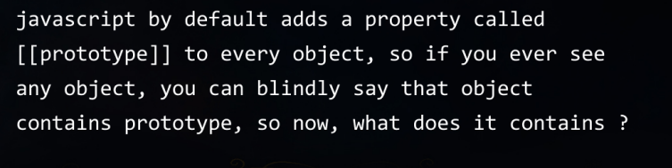

=> javascript single threaded hoti hai 
=> javascript synchronous hoti hai 

=> javascript execution context - defines the environment in which the code is executed 
                                  and includes things like the scope chain, variable object, 
                                  this value, and more.

 --------three main types of execution contexts-------
        
             1. Global Execution Context:
                - The global execution context is the default context. 
                  It's the environment in which the code outside of any function is executed.

                - It includes the global object (in a web browser, it's window), 
                  a this value (in a web browser, it's also window), and 
                  a reference to the outer environment (which is null in the global context).
        

             2. Function Execution Context:
                - When a function is called, a new execution context is created for that function. 
                  This includes its own scope chain, variable object, and this value.

                - The scope chain is formed by the function's variable object and the variable
                  objects of its parent contexts (including the global context).

                - The this value depends on how the function is called (more on that later).
        
             3. Eval Function Context:

                - In JavaScript, eval() can be used to execute code in the current scope or 
                  in the global scope. When eval() is executed, a new execution context is 
                  created.
-------------------------------------------------------------------------------------------------------------------

----------------------------------------------how js code is executed----------------------------------------------

1. memory creation phase 
2. execution phase

           let val1 = 10
           let val2 = 5
           function addnum(num1+num2){
               let total = num1+num2
               return total
           }
           
           let result1 = addnum(val1,val2)
           let result2 = addnum(10,2)

step1 => sbse pehle global execution hota hai aur isko this ke andar allocate krenge 

step2 => memory creation phase 

            val1 = undefined 
            val2 = undefined

            addnum = definition 

            result1 = undefined
            result2 = undefined

step3 => execution phase 

            val1 = 10
            val2 = 5

            addnum = definition 

            result1 = 
                       ===================== =================================================
            result2 =                      ||                                                 ||
                                           ||  new variable environment + execution thread    ||
                                           ||  // har baar nya bnta hai jitni bhi baar        || =========== >  kaam hone ke baad delete bhi ho jata hai 
                                           ||     functions execute hote hai                  ||
                                           ||                                                 ||
                                             =================================================
                                                                  ||
                                                                  ||
                                                                  ||
                                             =================================================  
                                             ||                                              ||
                                             ||                                              ||
                                        MEMORY PHASE                                    Execution Phase 

                                        val1 = undefined                                  val1 = 10
                                        val2 = undefined                                  val2 = 5
                                        total = undefined                                 total = 15
                                                            

----------------------------------------------------------------------------------------------------------

------------------------------------------CALL STACK ------------------------------------------------------

-- The call stack is a data structure that keeps track of the current execution context. 
  It follows a Last-In, First-Out (LIFO) order, which means the most recently added context is the 
  first to be removed.

-- When a function is called, its context is pushed onto the stack. When a function finishes executing, 
  its context is popped off the stack, and control returns to the context below it.

-----------------------------------------------------------------------------------------------------------

------------------------------------------truthy-falsy values------------------------------------------------------

Truthy vs falsy 

0 "" NaN undefined null - false  

Else every thing will be converted to true 

---------------------------------- NULLISH COALESCING OPERATOR( ?? )-----------------------

===========================================================================================

------------------------------ HIGHER ORDER functions -------------------------------------

higher-order function is a function that can take one or more functions as 
arguments and/or return a function as its result. 
This means that functions are treated as values, just like strings or numbers. 

==============================================================================================

---------------------------------- MAPS -----------------------------------------------

// maps iteratable nhi hote

Maps => The Map object holds key-value pairs and remembers the original insertion order of the keys. 
        Any value (both objects and primitive values) may be used as either a key or a value.

suppose you have to perform a particular task on every member of the array , multiply every element of arrray with 2 
and then place the answers in the new array and eventually return that new array and that's exactly waht map does

==============================================================================================

---------------------------------- FILTER -----------------------------------------------

filter => creates a shallow copy of a portion of a given array, filtered down to just the elements 
          from the given array that pass the test implemented by the provided function.

Suppose you have an array and you want to filter out elements in a new array we will use filter 
let's sat array contains many numbers we want to extract only those numbers which are greater than 5
we will use filter 

==============================================================================================

---------------------------------- REDUCE ----------------------------------------------------

reduce => executes a user-supplied "reducer" callback function on each element of 
         the array, in order, passing in the return value from the calculation on 
         the preceding element. The final result of running the reducer across all 
         elements of the array is a single value.

EK array ki saari value par kuch perform karke ek value banane ke liye we use reduce

example => add all value of array, when we add all values , it gives us the sum which is a single value 
           any such case where we need to convert array into a single value that's where reduce is used 

==============================================================================================

---------------------------------- DOM ---------------------------------------------------

                              

                  =================================================
                ||                                                 ||
                ||                  WINDOW                         ||
                ||                                                 || 
                  =================================================
                                      ||
                                      ||
                  =================================================
                ||                                                 ||
                ||                  DOCUMENT                       ||
                ||                                                 || 
                  =================================================
                    ||                                            ||
         =========================                      =========================
       ||          HEAD           ||                  ||         BODY            ||
         =========================                      =========================
            ||              ||                              ||              ||
          meta            title                             h1               p

HTMLCollection me loop nhi laga skte usko pehle array me convert krna pdega lekin nodelist me 
hum direct loop laga skte hai 

==============================================================================================

---------------------------------- events ---------------------------------------------------

* Event propagation in JavaScript refers to the way events move through the different 
  elements in a web page's DOM (Document Object Model).

=> There are two main phases of event propagation:

  1.Capturing Phase:

  > In this phase, the event starts from the outermost element (usually the window object) 
    and moves towards the target element.
  > It's like a "pre-processing" phase where elements higher up in the DOM tree get a chance 
    to intercept the event before it reaches the target element.
    Bubbling Phase:

  2.Bubbling Phase:

  > Once the event reaches the target element, it then "bubbles up" through the ancestors of the target element.
  > This is like a "post-processing" phase where elements higher up in the DOM tree get a chance to react to the event
    after it has been handled by the target element.

==============================================================================================

---------------------------------- ASYNC JS  ---------------------------------------------------

## blocking code                                                ## non blocking code                                      
       |                                                                  |
  block the flow of                                                does not block execution
  program                                                                 |
       |                                                                  |
  read file sync                                                   read file async

  